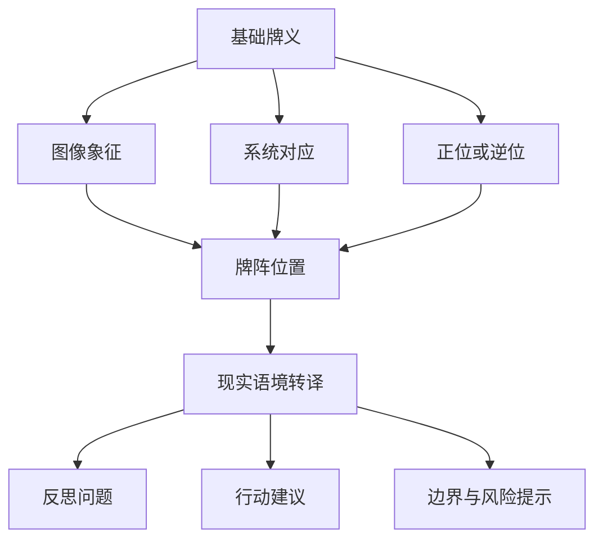
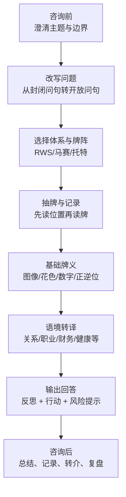

# 塔罗占卜师在不同现实语境中使用牌义的研究报告

## 执行摘要

本报告把“牌义”理解为一个由历史文献、图像象征、系统对应与咨询语境共同生成的语义系统。检索显示，塔罗从文艺复兴时期的纸牌文化进入十八世纪法国的神秘学与占卜实践后，才逐渐形成今天常见的“牌义—牌阵—咨询”框架；二十世纪则主要由莱德—伟特—史密斯体系与托特体系扩展为当代实务的两条主线。现代占卜师并不是机械背诵关键字，而是在正位/逆位、位置、邻牌关系、元素与数理、问句设计、客户语境之间做“语用转译”。同一张牌在恋爱、事业、财务或健康语境里，基础义未必改变，但表述方式、隐喻与建议强度必须改变。对健康、法律、财务等敏感议题，严谨做法应使用条件式、倾向式与转介式语言，而不是诊断、断案或保证结果。 citeturn29view1turn29view0turn31search5turn7view1turn35view0turn37view0turn8view0turn9view3

## 研究范围与假设

本报告采用以下工作假设。其一，用户未指定文化或地域，因此默认**不设特定地域限制**；涉及法律、医疗、财务等议题时，仅讨论一般性的实务边界，不替代当地专业规范。其二，用户未指定塔罗体系，因此默认**以莱德—伟特—史密斯为主**，并用马赛与托特体系做差异对照。其三，用户未指定咨询时长与客户类型，因此默认**常见的一小时成人个人咨询**。其四，用户提到“宫位/牌阵位置”，本报告将“宫位”主要理解为**牌阵中的功能位置**；若读者采用金色曙光或托特系方法，则可再叠加占星、卡巴拉与十度区间等对应。其五，本报告讨论的是**牌义如何被使用与转译**，而不是对占卜有效性的科学检验。 citeturn33view0turn18view0turn12view0

## 牌义来源与语义结构

如果按“来源链”来理解牌义，最稳妥的做法是把文献分成四层：原始文献、历史/馆藏资料、长期实务教育者、中文学习资源。原始文献方面，最核心的仍是 entity["book","The Pictorial Key to the Tarot","1911"]、entity["organization","Hermetic Order of the Golden Dawn","uk occult order"] 相关材料，以及 entity["book","The Book of Thoth","1944"]；历史背景可由 entity["point_of_interest","The Morgan Library & Museum","New York, NY, US"]、entity["point_of_interest","British Museum","London, England, UK"] 与《大英百科全书》补足；现代实务则主要借助 entity["organization","Biddy Tarot","online tarot education"]、entity["organization","Labyrinthos","online tarot school"]、entity["people","Mary K. Greer","tarot scholar"] 与 entity["people","Benebell Wen","tarot author"] 等长期写作者；中文学习上，现阶段以译作与实务书最丰富。entity["people","Arthur Edward Waite","occult writer"] 与 entity["people","Pamela Colman Smith","tarot artist"] 所奠定的 RWS 图像学，和 entity["people","Aleister Crowley","occultist"] 的托特体系，依然是现代多数实务的主要参照。 citeturn29view1turn29view0turn29view2turn31search5turn6view0turn17view0turn25search9

从历史上看，塔罗起源于十五世纪米兰公爵委托制作的早期牌组，后来才成为占卜工具；《大英百科全书》指出，塔罗被系统改造为神秘学与占卜工具，大约发生在十八世纪法国；大英博物馆则把 Etteilla 归为“以塔罗普及占卜并以此谋生的第一位职业塔罗师”。这意味着今天所谓“传统牌义”，其实本身就是一个**后起的、层层叠加的解释传统**，并不是自中世纪一直不变的单一词典。 citeturn29view1turn29view0turn31search5

更关键的是，Waite 自己就把牌义写成了“双层结构”：一层是可记忆、可操作的“官方”占卜义，另一层是由读牌者的直觉与经验去补充的解释层。他在《The Pictorial Key to the Tarot》中先列出正位/逆位关键词，又承认大阿卡那的占卜义带有相当程度的人工配置；与此同时，他又明确说有直觉与洞见的读牌者会在既有经验之外做补充。换句话说，**传统牌义从来不是只有“固定含义”，而是“固定含义 + 操作位置 + 直觉补足”**。这正是现代语境化解读的历史基础。 citeturn7view1turn7view0

若把牌义拆成语义结构，可以归纳为五层。第一层是**词汇层**：例如圣杯偏情感、钱币偏资源与现实；第二层是**象征层**：图像、姿态、颜色、器物与叙事场景；第三层是**系统层**：正逆位、元素、数理、卡巴拉或占星对应；第四层是**句法层**：牌阵位置、邻牌关系、是否相互强化或削弱；第五层是**语用层**：问题所处的现实语境、客户的用词、咨询边界与建议强度。综合来看，占卜师真正做的不是“给一张牌找唯一答案”，而是把这五层信息压缩成一个可理解、可讨论、可行动的回答。 citeturn8view4turn12view0turn29view0turn33view0turn37view0

以下流程图把这种语义结构简化成一个可操作模型。它并非原典原文，而是对 Waite、Golden Dawn、Crowley 与现代实务写作的归纳。 citeturn7view1turn12view1turn18view0turn12view0turn37view0

在体系差异上，马赛、RWS 与托特的区别非常影响“如何用牌义”。马赛小阿卡那多为 pip cards，更依赖花色与数字结构；RWS 的小阿卡那被充分叙事化，便于直接做关系、职业、心理与场景翻译；托特则把占星、卡巴拉、炼金术压得更深，甚至把 Strength/Justice/Temperance/Judgement/World 改写为 Lust、Adjustment、Art、Aeon、Universe。对咨询实务的影响是：**马赛偏结构推导，RWS偏图像叙事，托特偏对应学系统整合**。 citeturn34view0turn35view0turn20view0turn20view2

如果只看花色与数字，传统与现代之间也有明显“扩义”。《大英百科全书》保留了较旧的领域划分：权杖偏事业与野心、圣杯偏爱情、宝剑偏冲突、钱币偏金钱；现代教学中，这套骨架通常被扩大成：权杖=驱动力与创造性，圣杯=情感与关系，宝剑=认知、边界与沟通，钱币=资源、身体、劳动与制度。数字上，现代常把 1–10 简化为“开始—平衡—增长—结构—冲突—协调—评估—执行—收成—完成”的循环。这样一来，同一张牌就能跨语境使用：例如钱币四不只是在“钱”上保守，也可能是在关系里防御、在职业里过度控制、在健康里过度紧绷。 citeturn29view0turn8view4turn24view0

在正位/逆位问题上，现代实务比传统更灵活。Biddy Tarot 与 Labyrinthos 都强调：逆位不必被读成“坏”；它更常被理解为能量失衡、过度、减弱、阻塞、内化，或者语义相反。Benebell Wen 进一步指出，并非所有读牌者都读逆位；是否采用逆位，往往取决于读牌者更偏分析还是更偏图像直觉。严格说，逆位不是另一套固定词典，而是**对基本牌义施加一个方向性修饰**。 citeturn14view1turn14view2turn14view3

牌阵位置则构成另一种“句法”。Waite 的凯尔特十字里，“遮盖”是总体气氛，“横跨”是阻碍，“上方”是理想与可达上限，“下方”是基础，“前方”是即将进入的影响，“结果位”是由前面因素共同导致的趋向。Labyrinthos 对凯尔特十字的现代说明尤其重要：未来位与结果位都应理解为**在当前条件不变时的倾向**，而不是绝对命运。也因此，现实语境中的严谨表达，不应说“你一定会”，而应说“如果目前模式不变，更可能走向……”。 citeturn33view0turn11view0turn29view0

为了把“位置就是语法”这个观点落地，三张牌牌阵往往比大牌阵更实用。Mary Greer、Biddy 与 Labyrinthos 都把三张牌看作高度可移植的基础格式：过去—现在—未来，现状—阻碍—建议，我—关系—对方，观点 A—额外考量—观点 B，都属于**用位置规定问题结构**，而不是让每张牌脱离语境独立发言。 citeturn28view0turn10search3turn11view1

## 现实语境中的适配方法

先给出一个总原则：现实语境中的牌义适配，通常不是“换掉原牌义”，而是做四个动作。第一，把牌义从抽象关键词翻成该语境能听懂的语言；第二，把“结果”改说成“当前轨迹/倾向”；第三，把“因果断言”改成“可控制条件与反应方式”；第四，把“神秘判断”改成“建议型或反思型对话”。Biddy Tarot 与 Labyrinthos 都强调，好的问句应开放、具体、赋权，并尽量聚焦咨询者本人，而不是把塔罗变成替他人做结论的工具。 citeturn37view0turn38view0

为避免把合成示例误认成真实判例，下面每个语境的案例表都仅用于展示**如何从原牌义推到语境化表达**，不表示任何牌在该语境里只有一种读法。各表中的“原牌义”依据的是 Waite 的正逆位思路、花色/数字的一般结构，以及现代实务写作中常见的图像叙事与问句设计。 citeturn7view1turn8view4turn14view2turn24view0

### 情感与恋爱

恋爱语境最常见的错误，是把牌义读成“最后会不会在一起”“他到底爱不爱我”这种封闭判决。更稳妥的做法，是把牌义翻译为互动节奏、依附方式、冲突结构、边界协商与期待管理。常用位置是“我—关系—对方”或“现状—阻碍—建议”；当恋爱问题里出现大量钱币牌时，现代实务通常会把它改读为金钱、工作、居住安排、时间投入与现实成本对关系的影响，而不是认定“抽错牌”。问句也应尽量转成“我如何改善互动”“我在这段关系里看漏了什么”。 citeturn24view0turn38view0turn28view0

**问句模板**：  
“我在这段关系里现在最需要看清什么？”  
“我可以怎样改善彼此的沟通与边界？”  

**牌阵要点**：  
三张牌优先用“我—关系—对方”或“现状—阻碍—建议”。  

**表述策略**：  
把牌义讲成“动态”与“模式”，少讲“定论”。  

**避免说法**：  
避免“他一定会回头”“你们注定结婚”。更安全的是“当前互动里……更明显”“如果维持现状，关系更可能朝……发展”。 citeturn37view0turn11view0

| 案例/牌阵 | 原牌义 | 语境化解读 | 建议话术 |
|---|---|---|---|
| 我—关系—对方：圣杯二／钱币四／隐士 | 圣杯二=互惠与吸引；钱币四=抓紧、防御；隐士=退后、独处、审慎 | 关系基础并未消失，但目前更像“有连结—怕受伤—先抽离”的循环；焦点不是“爱不爱”，而是安全感与空间如何协商 | “我看到连结还在，但防御感很重。与其追问承诺，不如先谈联系频率、边界和你们各自需要的空间。” |
| 现状—阻碍—建议：恋人逆位／圣杯七／力量 | 恋人逆位=失衡、价值不一致；圣杯七=想象过多、投射；力量=柔和控制、自我稳定 | 主要问题是把想像当现实，或以情绪替代澄清；建议先统一关系定义与价值排序 | “这组牌不像是在说‘没机会’，更像在提醒：先把幻想、暧昧和真实需求分开。你可以先问清楚双方想要什么，再决定投入多少。” |

### 职业与事业

职业语境里，牌义通常要从“人格感觉”翻成“工作机制”。例如权杖不只代表热情，还可能是领导意愿、项目推进、市场开拓；钱币不只讲收入，也讲流程、技能、产出与组织资源；宝剑常常指沟通、边界、 KPI、汇报与判断压力。最实用的位置通常是“现状—优势/阻碍—下一步”或“现状—行动—结果倾向”。如果问的是转职或换跑道，Labyrinthos 的决策牌阵提醒我们，把“价值、动机、理想结果”放到选项之前，往往比问“哪份工作一定更好”更严谨。 citeturn24view0turn38view0turn24view2

**问句模板**：  
“我现在推进职业目标的主要阻力是什么？”  
“我该如何更有策略地准备转职/晋升？”  

**牌阵要点**：  
三张牌可用“现状—阻碍—建议”；五张牌适合“动机—理想结果—价值—选项甲—选项乙”。  

**表述策略**：  
尽量把牌义转成技能、资源、组织关系、节奏与决策条件。  

**避免说法**：  
避免“你一定会升职”“这家公司就是你的天命”。应改说“这更像是升职所需条件”“当前路径对你更匹配/更消耗”。 citeturn37view0turn24view2turn11view0

| 案例/牌阵 | 原牌义 | 语境化解读 | 建议话术 |
|---|---|---|---|
| 现状—优势—建议：钱币八／魔术师／权杖三 | 钱币八=打磨技能；魔术师=主动性、资源整合；权杖三=扩展、远景 | 你的职业问题不在“能不能”，而在“何时把熟练度转换成可见成果”；适合做作品集、项目展示、主动争取 | “牌面很支持把幕后能力变成台前成果。下一步不是再默默加班，而是把完成度高的工作整理成可被看见的成绩。” |
| 现状—阻碍—结果倾向：高塔／钱币五／星星 | 高塔=剧烈变动；钱币五=资源匮乏、失落；星星=修复、重新定位 | 失业、裁撤或项目崩塌后，最重要的不是立刻证明自己，而是先稳住现金流与方向感，再做公开投递或转轨 | “这组牌不建议你把当前打击理解为‘我不行’，而更像一次被动重组。先做预算与求职优先级，再保留一个能让你恢复信心的小项目。” |

### 财务

财务语境最容易滑向“买不买、涨不涨、会不会发财”的硬预测。更稳妥的做法，是把牌义读成资金习惯、风险承受度、资源配置、消费模式、短期与长期目标冲突，以及“我是否看清了成本结构”。Labyrinthos 与 Biddy 的实务建议都偏向把问题改写成“我该如何改善财务处境”“我当前最大的财务障碍是什么”，而不是要求塔罗替代财务规划。钱币花色当然是核心，但宝剑常常意味着合约与判断，月亮、命运之轮之类的大牌则更适合读成不确定性与波动，而不是“神谕式暴富信号”。 citeturn38view0turn37view0turn24view0turn9view3

**问句模板**：  
“我当前最大的财务盲点是什么？”  
“我该如何在风险与稳定之间做更合适的安排？”  

**牌阵要点**：  
可用“障碍—行动—结果倾向”或“选项甲—需注意—选项乙”。  

**表述策略**：  
用预算、现金流、风险、时间跨度与资源分配来翻译牌义。  

**避免说法**：  
避免“这笔一定赚”“你命里有偏财”。更好的说法是“这显示高波动/低可见度”“更适合小额试错而非重仓”。 citeturn11view0turn37view0turn9view3

| 案例/牌阵 | 原牌义 | 语境化解读 | 建议话术 |
|---|---|---|---|
| 障碍—行动—结果倾向：钱币四／节制／钱币六 | 钱币四=过度保守或抓紧；节制=调配、平衡；钱币六=收支交换、互惠 | 你不是完全没资源，而是资源使用过度僵硬；重点在现金流与预算节奏，而不是只盯“存或花”二选一 | “牌面像是在提醒你：问题不只是收入，而是调度。先把固定支出、缓冲金和可投资额度分层，会比继续一味收紧更有效。” |
| 选项甲—需注意—选项乙：钱币一／月亮／命运之轮逆位 | 钱币一=现实机会；月亮=信息不明、情绪干扰；命运之轮逆位=波动、时机不顺 | 选项甲看上去更稳，但仍要补充信息；选项乙可能更刺激，却伴随更高不可控性 | “如果你问的是‘该不该全押’，这组牌不会支持。它更像建议：把不确定来源查明，再用小规模测试，而不是一次性承担全部波动。” |

### 健康

健康语境是最需要降调处理的领域。Biddy Tarot 与 Benebell Wen 都明确建议：塔罗不应被用来诊断疾病、替代医生、决定停药，甚至在某些法域中，未经资格提供医疗性建议可能带来风险。相对安全的做法，是把健康问题改写成“身心压力如何影响我”“我现在最需要怎样的照护与支持”“这段疗程中我如何与专业意见合作”。牌阵上最适合的是“身—心—灵”或“当前负担—支持资源—下一步照护”。换言之，健康解读的语气应该是**照护式、转介式、趋势式**，而不是诊断式。 citeturn8view0turn9view3turn8view6turn28view0

**问句模板**：  
“我当前的身心负荷最需要被如何照顾？”  
“在接受专业治疗/建议时，我该怎样更好地支持自己？”  

**牌阵要点**：  
优先用“身—心—灵”或“负担—支持—照护行动”。  

**表述策略**：  
把牌义翻成压力管理、休息质量、支持系统、习惯与配合度。  

**避免说法**：  
避免“你会得某病”“这张牌显示手术失败”。应改说“我不会用塔罗做诊断；这更像是在提醒你关注压力与恢复，并尽快与专业人士确认”。 citeturn9view3turn8view6

| 案例/牌阵 | 原牌义 | 语境化解读 | 建议话术 |
|---|---|---|---|
| 身—心—灵：宝剑九／宝剑四／星星 | 宝剑九=焦虑与失眠；宝剑四=休息与暂停；星星=修复与希望 | 重点并非“出了什么大问题”，而是长期紧绷已经超过可恢复阈值；要把休息视为干预，不是奖赏 | “我不会把这组牌解读成诊断，但它很明显在提示过载。你现在需要的是把休息、检查与支持排进日程，而不是再硬撑。” |
| 负担—支持—照护：权杖十／圣杯皇后／节制 | 权杖十=负担过重；圣杯皇后=照护、情绪敏感；节制=调和、节律 | 健康困扰可能与情绪劳动、照顾别人过多、作息失衡有关；建议放慢节奏并寻求支持 | “这不像单纯体力问题，更像情绪与责任一起压上来了。你可以先做两件事：缩减一个非必要负担，并把一个支持性资源真正用起来。” |

### 决策与人生方向

决策语境最适合体现“概率而非宿命”的表达习惯。Labyrinthos 的五张决策牌阵把“动机、理想结果、价值观”放在两个选项之前，实际上是在提醒读牌者：真正需要被解释的，不只是 A 还是 B，而是“为什么你会在这两者之间摇摆”。因此，决策类牌义常常要把问句从“哪条路是天命”改写成“哪条路更符合我当前价值与资源条件”。这里的结果位尤其应该讲成“当前条件不变时的倾向”，而不是一锤定音。 citeturn24view2turn37view0turn11view0

**问句模板**：  
“这两个选择分别要求我承担什么代价？”  
“什么决定更符合我当下的价值、资源与节奏？”  

**牌阵要点**：  
优先用五张决策牌阵；快速版可用“选项甲—你需要知道—选项乙”。  

**表述策略**：  
把“命运”翻成“代价、机会成本、价值一致性、时间窗口”。  

**避免说法**：  
避免“宇宙替你选好了”。更严谨的是“牌面支持你看见每个选项在资源、节奏与身份上的要求”。 citeturn24view2turn37view0

| 案例/牌阵 | 原牌义 | 语境化解读 | 建议话术 |
|---|---|---|---|
| 选项甲—你需要知道—选项乙：战车／吊人／愚人 | 战车=推进与掌控；吊人=暂停、换视角；愚人=新开始、风险 | 甲路更适合已有准备、要速度和执行；乙路更适合愿意承受不确定但换来新经验；真正的关键是你是否肯先停下来校准视角 | “牌不是在替你选，而是在说：如果你要快，甲比较合适；如果你要重新开始，乙更像一条试错路。但在做决定前，你还缺一次真正的停顿和复盘。” |
| 现状—行动—结果倾向：审判／权杖二／太阳 | 审判=召唤、觉醒；权杖二=规划、远景；太阳=清晰、可见成果 | 这不是“灵性召唤突然从天而降”，而是你已经到了需要把长期想法具体化的阶段；方向感来自规划，而不是等感觉 | “我会把这组牌翻译成：你已经知道想往哪里去，只是还没把它变成路线图。请把愿景拆成三个月内能执行的步骤。” |

### 法律与伦理冲突

法律/伦理类问题最需要边界说明。Waite 的旧式方法甚至会把 Justice 当成诉讼主题的标志牌，但现代伦理写作普遍不建议读牌者预测案件胜负、替代律师、代替当事人搜集“对方在想什么”。更稳妥的做法，是把牌义转译成程序压力、证据意识、沟通边界、价值冲突与“我应该如何更好地与专业意见合作”。Benebell Wen 特别建议：出现法律问题时，可把问题重写成“我需要知道什么，才能做出更负责任的决定”，而不是“我能不能赢”；第三方问题也宜改为“这段关系/事件对我意味着什么”，而不是直接窥探他人。 citeturn33view0turn9view3turn40view0

**问句模板**：  
“面对这场法律/伦理冲突，我最需要理解的程序或边界是什么？”  
“我怎样才能在价值、责任与现实后果之间做更稳妥的选择？”  

**牌阵要点**：  
可用“现状—我能控制—专业支持”或“价值—风险—下一步沟通”。  

**表述策略**：  
把牌义翻成程序、责任、边界、证据与沟通方式。  

**避免说法**：  
避免“你一定胜诉”“对方就是坏人”“牌告诉你该不该离婚/起诉”。应改说“这不是律师意见；牌面更像在提醒程序、边界与沟通风险”。 citeturn8view0turn9view3turn40view0

| 案例/牌阵 | 原牌义 | 语境化解读 | 建议话术 |
|---|---|---|---|
| 现状—我能控制—专业支持：正义／宝剑七／教皇 | 正义=规则、公平、法务；宝剑七=策略、信息不对称；教皇=制度、专业意见 | 当前重点不是情绪胜负，而是程序、证据与合规；你能控制的是准备与策略，而不是法院或他人 | “我不会替律师下判断，但这组牌很强调程序与专业意见。请把注意力放到事实整理、文件准备和你该问律师的关键问题上。” |
| 价值—风险—下一步沟通：宝剑皇后／恶魔／节制 | 宝剑皇后=清晰边界；恶魔=纠缠、利益绑定；节制=调解与比例感 | 你可能正被愤怒、依赖或现实利益捆住；真正的难点在于怎样既保住边界又不把冲突升级 | “这组牌不鼓励你冲动决裂。更像是提醒：先把底线写清楚，再选择一种不扩大伤害的表达方式；具体法律动作依然要让专业人士把关。” |

### 创意与灵性成长

创意/灵性成长是最适合把塔罗当成“自我反思工具”而非预测工具的领域。Biddy Tarot 把“提问的质量”直接与自我反思、指导与转化联系起来；Benebell Wen 把 Tarot 明确定位为促进个人成长的方法；Mary Greer 则长期推动塔罗日记、每日抽牌与自我书写。也因此，这个语境里的牌义不宜被讲成“你有无灵性天赋”，而更适合讲成“你在什么地方卡住了想象力、害怕表达、失去练习结构、或需要一段内在整理”。常见位置是“头—心—灵魂”“当前阻塞—隐藏资源—练习方法”。 citeturn37view0turn25search9turn28view1turn25search1

**问句模板**：  
“我当前创作/修行的真正阻塞点是什么？”  
“什么练习能帮助我恢复直觉、节奏与表达？”  

**牌阵要点**：  
可用“头—心—灵魂”或“阻塞—资源—练习”。  

**表述策略**：  
把牌义翻成练习习惯、表达恐惧、内在素材、象征工作与复盘方式。  

**避免说法**：  
避免“你天生不适合创作”“这是业力在惩罚你”。更好的说法是“你当前更像卡在某种模式里，这张牌提示的练习方向是……”。 citeturn28view0turn25search9turn28view1

| 案例/牌阵 | 原牌义 | 语境化解读 | 建议话术 |
|---|---|---|---|
| 头—心—灵魂：圣杯侍者／隐士／权杖一 | 圣杯侍者=想象、直觉；隐士=独处、内省；权杖一=火花、开端 | 创作并非没有灵感，而是灵感还停留在私人感受层，没有被点火成作品或行动；需要从“感受”走向“启动” | “你不是没有东西可写，而是还没给自己一个开始。可以先做一个很小的创作承诺，比如连续七天每天产出十分钟。” |
| 阻塞—资源—练习：圣杯侍者逆位／女祭司／钱币三 | 侍者逆位=自我怀疑、创意阻塞；女祭司=内在知识；钱币三=工艺、协作、练习 | 真正的堵塞点不是没灵感，而是灵感没有变成可重复的方法；需要通过固定练习与反馈把直觉落地 | “我会把这组牌读成‘内在素材很多，但缺方法’。你可以把灵感记录、每周复盘和一次外部反馈变成固定流程。” |

## 咨询流程、核查清单与伦理

从实务角度看，占卜前、中、后最核心的不是“会不会读牌”，而是**会不会把牌义安全地放进咨询流程**。Biddy Tarot 的伦理文章强调只在自身专业范围内工作、保密、不给医疗/法律/财务建议；Benebell Wen 进一步给出几乎可直接使用的免责声明：不能以塔罗替代医生、律师、财务顾问，也不应把塔罗当成确定性的未来判断工具；关于第三方阅读，她则主张至少应把问题改写到“咨询者与事件/他人的交点”上。 citeturn8view0turn8view6turn9view3turn40view0turn39search8

下面这个流程图把 Waite 的牌阵位置逻辑、Greer 的基础牌阵思路、现代开放式问句与当代伦理边界合成在一起，形成一个一小时个人咨询可直接执行的流程。 citeturn33view0turn28view0turn37view0turn8view0turn9view3

把它拆成核查清单，实际会更清楚：

| 阶段 | 核查项目 | 伦理与风险提醒 |
|---|---|---|
| 咨询前 | 把“会不会、是不是、什么时候”改成“我现在需要看清什么、我能做什么” | 对健康、法律、财务、严重心理困扰先做边界声明；必要时直接建议转介专业人士。 citeturn37view0turn38view0turn8view0turn9view3 |
| 咨询前 | 确认是否涉及第三方、未成年人、家暴、自伤、医疗停药、法律胜负、投资决策 | 第三方问题尽量改写到“这件事对你意味着什么”；不要窥探未同意者的私事。 citeturn40view0turn39search12 |
| 咨询中 | 先读位置功能，再读牌义；先讲可观察模式，再讲建议 | “结果位”讲成当前轨迹或趋势，不讲成不可更改的命运。 citeturn33view0turn11view0 |
| 咨询中 | 用条件句、倾向句、选择句组织答案 | 例如“如果维持现状，更可能……”而不是“你一定会……”。 citeturn11view0turn37view0 |
| 咨询中 | 将牌义翻成客户语境中的隐喻 | 职业用项目/资源/流程语言，关系用互动/边界/节奏语言，健康用照护/恢复/支持语言。 citeturn24view0turn38view0turn9view3 |
| 咨询后 | 用三句话收束：我看到的模式、你可控的下一步、需要外部支持的部分 | 对敏感议题保留书面免责声明与转介建议；必要时说明“娱乐/精神性咨询”性质视法域而定。 citeturn8view6turn39search14 |
| 咨询后 | 记录牌阵、问句、反馈与复盘 | 通过塔罗日记积累“牌义—语境—结果”对照，不断校正语言。 citeturn28view1turn25search17 |

在语言层面，最值得直接练习的是“去绝对化”。下表给出一个实务转换模板：

| 易误导说法 | 更稳妥的替代表述 |
|---|---|
| “你一定会胜诉。” | “这组牌更强调程序、准备与边界；案件判断请以律师意见为准。” |
| “他就是不爱你了。” | “当前互动里更显著的是防御、抽离或节奏不一致，而不是稳定回应。” |
| “你会得病。” | “我不会做诊断；这更像在提醒你关注压力、恢复与专业检查。” |
| “这笔投资肯定能赚。” | “眼下更像高波动/低透明度场景，适合先核实信息与控制仓位。” |
| “宇宙已经替你选好了。” | “牌面在显示不同路径对资源、节奏与价值的一致性要求。” |

这些替换并不是“把塔罗说得更保守”，而是在保持牌义的前提下，把它说成**对现实负责的咨询语言**。其核心标准只有三个：不剥夺当事人能动性，不替代专业意见，不把象征语言伪装成事实判断。 citeturn37view0turn8view0turn9view3turn40view0

## 训练路径

占卜师若想把牌义真正用在现实咨询里，学习顺序最好不是“背完 78 张牌义”，而是分成四段推进。第一段学**文献与体系骨架**：先读 RWS 主干，再认识马赛和托特差异。第二段学**语义拆解**：把每张牌拆成图像、花色、数字、位置、正逆位。第三段学**问句与牌阵句法**：先会用稳定的三张牌，再进入凯尔特十字或自定义牌阵。第四段学**伦理与专业边界**：尤其是健康、法律、第三方、未成年人、创伤与心理危机。Benebell Wen 给 Holistic Tarot 准备了明确的初级/中级/高级学习导引；Mary Greer 则长期强调日记与复盘的重要性。 citeturn25search2turn28view1turn28view0

如果把练习方法做成一套“基本功”，最有效的是以下四类。其一，每日单张牌日志：先写位置与第一反应，再查书比对。其二，同题多牌阵：同一个问题分别用“三张牌”和“凯尔特十字”，比较位置如何改变语义。其三，语境翻译操练：同一张牌分别写成恋爱版、职业版、财务版与健康版话术。其四，敏感议题模拟：练习如何在不诊断、不保证、不越界的前提下给出有帮助的回答。 citeturn28view1turn33view0turn37view0turn9view3

评估指标也最好不要只看“准不准”，而要看五件事：语义一致性、语境贴合度、可行动性、边界安全性、复盘可验证性。更具体地说，一次好解读至少要做到：牌阵位置读得通；花色/数字与图像没有互相打架；建议是客户能执行的小步骤；敏感题有明确转介；咨询记录能在一周后回看并校正。这个评估框架并非原典术语，而是根据现代塔罗教育与咨询伦理可操作地归纳出来的。 citeturn25search2turn28view1turn37view0turn8view0

## 快速上手指南与推荐资源

如果要把本报告压缩成一套可立即使用的五步法，可以这样做：

1. **先判断语境，再决定边界。**  
   先分清这是恋爱、职业、财务、健康、决策还是法律/伦理问题；一旦触及专业领域，先说清塔罗不是诊断、判案或投资指令。 citeturn8view0turn9view3

2. **把封闭问句改成开放问句。**  
   把“会不会、是不是、什么时候”改写成“我需要看清什么、我能做什么、我该如何准备”。 citeturn37view0turn38view0

3. **先读位置，再读牌。**  
   先决定这张牌在回答“现状、阻碍、建议、结果倾向、关系核心”中的哪一个问题，再把花色、数字、图像与正逆位叠上去。 citeturn33view0turn28view0

4. **把牌义翻译成该语境的现实语言。**  
   恋爱讲互动与边界，职业讲资源与流程，财务讲风险与配置，健康讲照护与恢复，法律讲程序与专业支持。 citeturn24view0turn38view0turn9view3

5. **用条件句收束，并留下一个可执行动作。**  
   最好的结尾通常是：“如果维持现状，更可能……；你现在最能控制的是……；下一步建议是……；涉及专业判断的部分请交给……”。 citeturn11view0turn37view0turn8view6

### 推荐资源清单

以下资源按“原典/权威—现代实务—中文优先”的思路排列；英文资料已注明。

**原典与历史资料**

- 《The Pictorial Key to the Tarot》（英）：RWS 牌义、正逆位与凯尔特十字位置的直接来源，适合作为“传统语义骨架”起点。 citeturn6view0turn7view1turn33view0
- 《The Book of Thoth》（英）：适合研究托特体系如何把卡巴拉、占星与炼金术压进牌义。 citeturn17view0turn18view0turn20view0turn20view2
- The Morgan Library & Museum 的 Tarot 展览说明（英）：适合确认塔罗的文艺复兴起源与 1909 RWS 的艺术影响。 citeturn29view1
- British Museum 关于 Pamela Colman Smith 与 Etteilla 的馆藏条目（英）：适合确认现代塔罗图像作者与早期职业塔罗占卜实践的历史位置。 citeturn29view2turn31search5
- 《大英百科全书》tarot 条目（英）：适合做概览，尤其是“法国约 1780 年后占卜化”“正逆位、牌阵位置、邻牌会修饰牌义”等要点。 citeturn29view0

**现代实务与方法论**

- Holistic Tarot（英）：以个人成长与整合式学习为核心，适合从“背牌义”过渡到“解释系统”。 citeturn25search9
- Mary K. Greer 的三张牌与塔罗日志文章（英）：非常适合训练牌阵句法、日常复盘与自我反思。 citeturn28view0turn28view1
- Biddy Tarot（英）：适合训练开放式问句、咨询语言、伦理边界与初中阶课程路径。 citeturn37view0turn8view0turn25search12
- Labyrinthos（英）：适合学习花色、数字、元素、逆位、马赛/RWS/托特差异与大量基础牌阵。 citeturn12view0turn34view0turn35view0turn32search3
- Benebell Wen 的伦理系列与学习导引（英）：适合职业化占卜师建立免责声明、敏感议题边界与分层学习路径。 citeturn8view6turn9view3turn40view0turn25search2

**中文优先书目**

- 《78度的智慧》：中文学习圈最常见的深度入门书之一，适合建立大阿卡那与 RWS 世界观。 citeturn22search0
- 《塔羅逆位精解》：适合把逆位从“坏牌”改理解为结构性修饰。 citeturn5search1turn5search5
- 《學會塔羅的16堂課》：偏系统化入门，适合搭骨架。 citeturn26search3turn26search15
- 《我的第一本！塔羅自學指南：從占星、數字、符號到色彩》：适合把元素、数字、图像与牌义连起来学。 citeturn22search2turn22search5
- 《塔羅占卜實戰指南》：更偏咨询现场与职业占卜师思路。 citeturn22search1turn22search3
- 《塔羅解讀入門課》：偏案例与实务整理，适合作为辅助读物。 citeturn26search7

**课程与社群**

- Biddy Tarot Community、Tarot 101、Read Tarot With Confidence（英）：适合需要课程结构、社群反馈与咨询表达训练的人。 citeturn37view0
- Labyrinthos Academy（英）：适合刚起步、需要免费课程、牌义与牌阵库的人。 citeturn32search0turn32search3
- 华语学习若考虑课程，建议优先挑选**有公开课程大纲、伦理声明、练习时数、个案演练与敏感议题边界说明**的机构；检索中可见的例子包括大学推广课程与分阶伟特课程，但是否适合仍应以当前课程表、师资背景与伦理规范为准。 citeturn26search0turn36view6

**建议的练习节奏**

- 连续一个月做每日单张牌日志。  
- 连续一个月只用三张牌，不急着扩牌阵。  
- 每周挑一张牌，分别写出恋爱版、职业版、财务版、健康版说法。  
- 每周至少模拟一次“边界型答复”：练习如何拒绝诊断、断案、代替投资判断。  
- 每月回看一次记录，检查自己是否仍在使用绝对化、宿命化、窥探式语言。 citeturn28view1turn28view0turn37view0turn8view0turn9view3